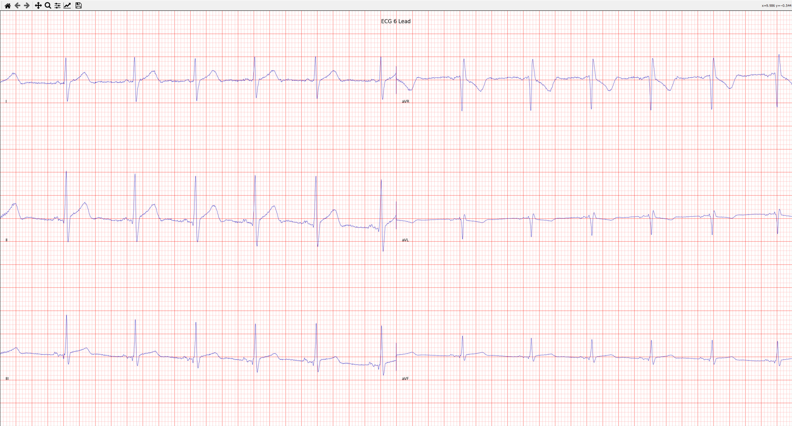

# Systolic
Master branch of code for host device of my ultra-low-cost electrocardiogram (ECG): Systolic. 

This program runs on the host device of the ECG and can configure and start/stop sampling of the ECG through a serial interface. It is made with Python and relies on PyQt for the GUI.

I'm still in the process of making more documentation and tests, so please let me know if you need any clarification on anything in the meantime.

## What are the results like?
Take a look, they're awesome, in my opinion!



## Setup
```shell
git clone https://github.com/OskarCodes/SystolicHost.git
cd SystolicHost/
pip install -r requirements.txt
```
And you're done =)!

## Contributing
I immensely appreciate any contribution to this project, no matter the size. Please feel free to make a pull request! If you have any questions, please do not hesitate to reach out.

## Licensing
This project is licensed under the GPL-3.0 license. I chose this because I want all changes to Systolic and supporting software, no matter who by, to be accessible to everyone. 
